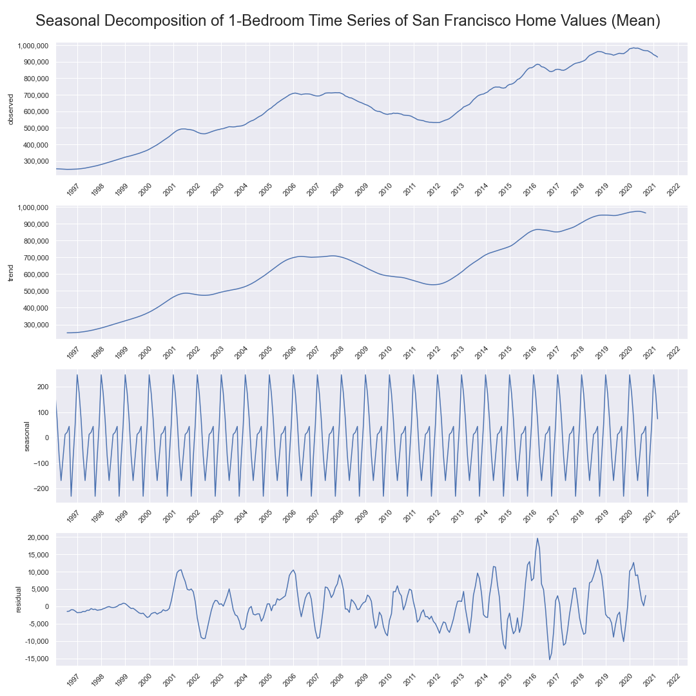
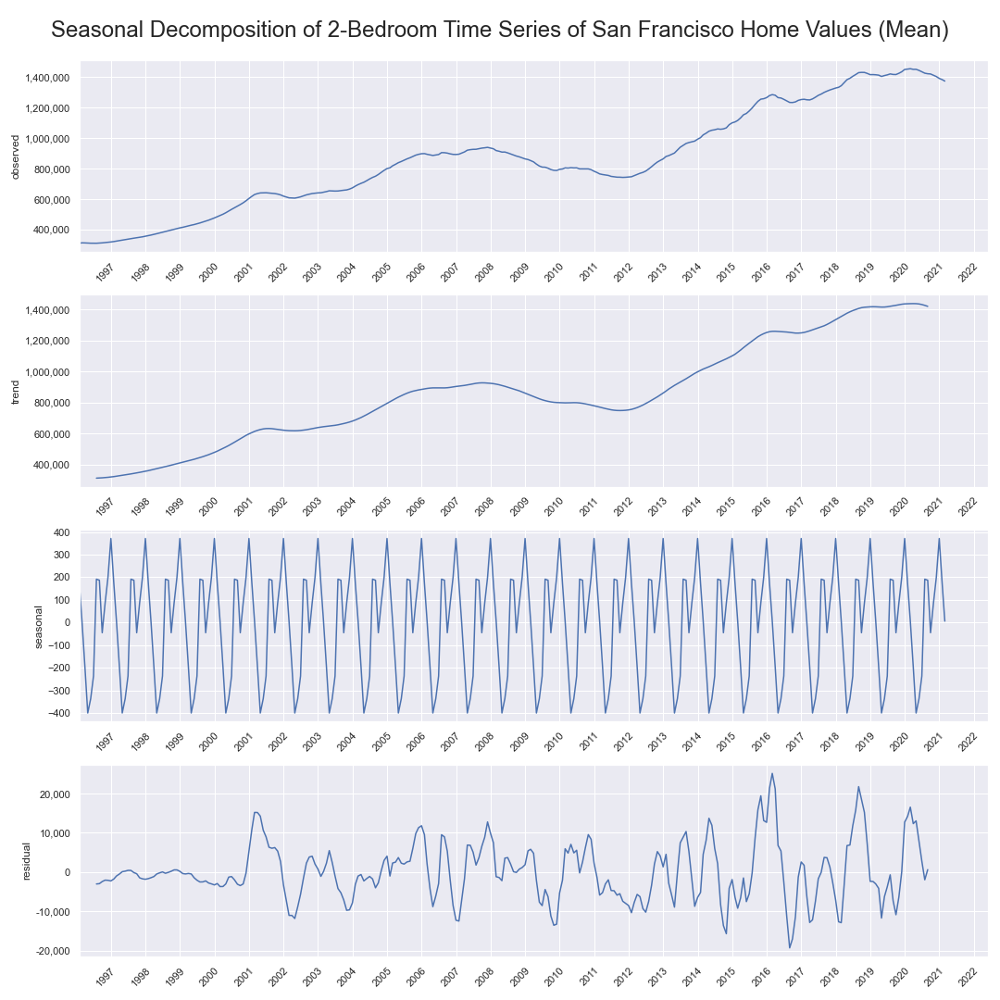
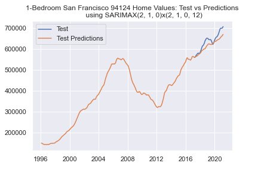
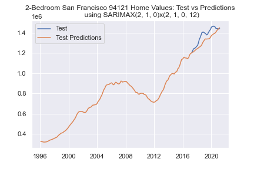
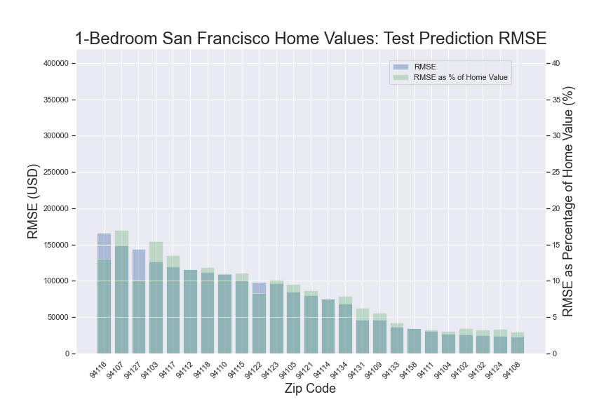
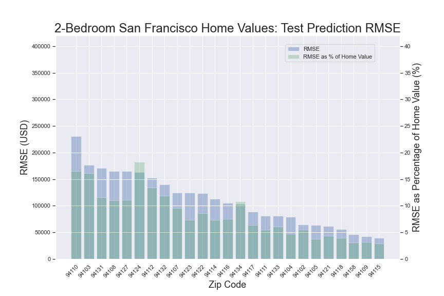

# Time Series projections for Zillow Housing Data for San Fracisco - Flatiron School Data Science Immersive (Phase 4 Project)
  
## Overview  
The pandemic has had far-reaching consequences for the global markets, with major indices plunging before making a sharp recovery. Real estate was negatively impacted, as metropolitan areas lost their appeal amidst closures and lockdowns. Resident housing, however, recovered and showed new strength as homebuyers started snatching up homes at a discount. As vaccine rollout continues and the economy recovers, we are seeing a boom in housing; 5.64 million homes were sold in 2020 (up 5.6% from 5.34 million in 2019), and home sales are projected to be 6.49 million in 2021 (a growth of 15%), according to the [National Association of Realtors](https://www.statista.com/statistics/226144/us-existing-home-sales/).

In this project, we examine and perform time series analysis on a data set of housing data from [Zillow Research](https://www.zillow.com/research/data/) to determine whether 1-bedroom or 2-bedrooms homes in San Francisco would be better for investment on a 1 year time horizon.  We look at each of the 25 zip codes across both data sets as separate time series, and project the price growth within a year for each to find the zip codes that will likely grow the fastest.

  
  
## Business Problem
The purposse of this project is to make informed recommendations to investment advisors, real estate brokers, and homeowners who are looking to invest in a mid-tier 1 or 2-bedroom home in the San Francisco area. This best captures the intent of a couple looking for their first home, or a yuppie looking to buy their first property, and may choose to upgrade and sell for a profit in one year.

## Data  
Our [data set](Zip_zhvi_bdrmcnt_2_uc_sfrcondo_tier_0.33_0.67_sm_sa_mon.csv) comes from the [Research division of Zillow Group](https://www.zillow.com/research/), used with permission. The data represents the typical home values for the zip codes listed for homes falling between the 35th and 65th percentile of home values. General info on the data set is available [here](https://www.zillow.com/research/zhvi-methodology-2019-highlights-26221), and full details are available [here](https://www.zillow.com/research/zhvi-methodology-2019-deep-26226).  
  
### Historical Data    
Typical home values are published on the third Thursday of each month, and gives monthly data from 1996 to present.  

### Target Variable  
We will forecast time series data 12 months in the future for all relevant zip codes (25 in total) in 1-bedroom and 2-bedroom data sets.  We will then compare the top performing zip codes.
  
## Methods  
Our methodology implements the CRISP-DM model for exploratory data analysis, cleaning, modeling, and evaluation.  
We leveraged SARIMAX modeling from [statsmodels](https://www.statsmodels.org/stable/generated/statsmodels.tsa.statespace.sarimax.SARIMAX.html) to analyze and forecast home values. The quality of our modeling was determined with the [AIC value](https://en.wikipedia.org/wiki/Akaike_information_criterion). We also performed statistical analysis via [SciPy Stats](https://docs.scipy.org/doc/scipy/reference/stats.html) to further make inferences on the data.  
Other tools used include Python, NumPy, and Pandas. Visualizations were created with MatPlotLib and Seaborn.  
  
## Approach
We look at the overall trajectory of housing prices for 1 and 2 bedroom homes:  
  
  

Using seasonal decomposition, we can see the overall trends:  
  
  

We plot the PACF and ACF to estimate AR (autoregressive) and the MA (moving average) order for ARIMA modeling, respectively.  This is shown for illustrative purposes only, as the actual AR/MA terms need to be tuned for each time series (each zip code).  
  
  
  
  

Using a GridSearchCV to determine best fit models and performing a stepwise historical cross-validation, we can evaluate model fit using RMSE.  
Here are two sample test / predict plots:  
  
  

Here are the plots of RMSE and RMSE as a percentage of Price for our best models, to show model error:  
  
  

Then, using our best models we forecasted prices one year into the future. Here are two sample forecasts:  
  
  

Finally, we calculate the percentage change forecasted for each zip code to determine which zip codes would grow the most. Here are the results graphically:  
  

## Conclusion
After running SARIMAX analysis on all zip codes in San Francisco, we found that the following zip codes showed the greatest projected appreciation in value:  

Type of Home    |  Zip Codes                    | Projected   Home Value   Growth  
:---------------|:------------------------------|-----------------------------:  
1-Bedroom Homes | 94124   94134   94132 | 6.03%   5.61%   3.57% 
2-Bedroom Homes | 94121   94116   94134 | 4.41%   3.07%   2.74% 

<b>We see that 1-bedroom homes in zip code `94124` and 2-bedroom homes in zip code `94121` show the greatest projected growth in value.</b>  
Perhaps unsurprisingly, **94124** currently has the lowest prices for San Francisco 1-bedroom homes. According to our model, in a year's time this zip code will move from the lowest to 5th lowest rank of the 25 zip codes.  
By contrast, **94121** currently has the 10th highest prices for San Francisco 2-bedroom homes. According to our model, this zip code will move up to the 6th rank in a year.

## Further Actions  
Using exogenous variables such as school district data, crime data, presence of parks/nature in vicinity, proximity to hospitals, groceries, entertainment, transportation etc., we can further refine our model as well as assign weights based on what a home buyer is looking to prioritize. We may find that growth in home value may be highly correlated to better education, lower crime rate, etc.   

We would like to further optimize our model by incorporating exogenous data on interest rates, market changes, macroeconomic indicators, and other large scale fluctuations. Using more sophisticated modeling tools, we may be able to model using multiple seasonalities, such as monthly, quaterly, yearly, etc. With more data, we would be able to more accurately forecast home values into the future.  

## Repository Structure
    .
    ├── code/                                # python helper functions
        └── functions.py                     # helper functions
    ├── crisp_dm_process/                    # initial EDA and model notebook files 
        └── SF_WIP.ipynb                     # notebook file with initial data exploration and rough insights
    ├── data/                                # project data sets as well as model output data
    ├── images/                              # visualizations; images for notebooks, README, and presentation slides
    ├── zillow_housing_final.ipynb           # primary project notebook 
    ├── Zillow_Housing_Project_JS_WAX.pdf    # presentation slides PDF
    └── README.md                            # this README
  
## Bibliography  
1. Data set Origin:  
  
       Zillow Research Housing Data  
               Zillow Group  
2. Date:    Thursday April 15, 2021
3. Web Source:  https://www.zillow.com/research/data/             
  

Authors  
  
Jonathan Silverman & Wei Alexander Xin   
    
[Jonathan's GitHub](https://github.com/silvermanjonathan) | [Alexander's GitHub](https://github.com/eggrollofchaos)  
[Jonathan's LinkedIn](https://www.linkedin.com/in/jonathansilverman007) | [Alexander's LinkedIn](https://www.linkedin.com/in/waximus)
